# Achromatic DEVLOG

> USC CTIN-532 2026 Spring

## Wed 2026-04-02

### Ying’s build notes

This week we are both working on the alpha braintrust presentation as well as feedback from playtesters we received in Alpha formal playtest. For the visual part, we are still lacking the background assets and theme coordination between background and characters which I need to continue to work on. Thus, the soundtracks we received from Berkelee are awesome and I’m designing these soundtrack corresponded background currently.
I have also just started to think about the UI design of our games.

## Wed 2026-03-18

### Ying’s build notes

This week I’m working on background and notes assets.

## Wed 2026-04-16
## Wed 2026-04-09
## Wed 2026-04-02

## Wed 2026-03-19

This week was a consolidation pass—tightening up what was already there rather than adding net-new systems, with one notable exception.

The standout addition is the **action hint system**: `ActionHint.cs` with dedicated prefabs for jump, squat, and attack, pooled through `ElementsManager`. It's the first piece of in-world feedback that tells the player what's coming, which makes the expanded `Lv1Beatmap` actually teachable rather than just a sequence of inputs to memorize. The old flat arrow icons got replaced with a proper `ActionHint.png` sprite sheet to match.

The other meaningful change was **flattening the note type system**—swapping the `NoteType` enum for a plain string field on `Note`. It sounds like a step backward but it's actually more practical at this stage: adding `jump_or_attack` or any future hybrid type doesn't require touching an enum file, and the JSON stays readable. `ElementsManager` was updated to handle all current type strings accordingly.

Beyond that, the week was largely about making the codebase trustworthy. `[DefaultExecutionOrder]` attributes on `Beatmap` and `Criteria` pin the initialization sequence so timing-dependent bugs don't sneak back in. `IDisposable` cleanup in `ElementsManager` closes the event subscription leak that had been sitting there. Variable renames like `beatPerSec` → `beatsPerSecond` and `IsPassByMiss` → `IsMissedByPassing` are small but they mean the next person reading the code doesn't have to guess. Debug logs got pruned from `InputManager` and `Starter` so the console output is actually useful again.

A couple of known rough edges got properly documented rather than quietly left: the jaggy movement bug (suspected `FixedUpdate` timing), and the missing prelude control state in `InputManager` both have `BUG` annotations now. They're not fixed, but they're flagged honestly—which is the right call before handing this off or picking it back up after a break.

## Wed 2026-03-12

This week the project crossed a threshold—less "making things work" and more "making things work *as a game*." The big architectural push was decomposing the monolithic player and piece scripts into proper MonoBehaviour components: `Movement.cs` for physics, `AnimationManager.cs` for animator control, `InputManager.cs` for action handling, all wrapped by a thin `Player.cs`. Same story on the piece side, where `Piece.cs` and `Starter.cs` now own what used to be tangled across `PieceScript`. The old `PieceScript.cs` is gone, and so are the temp debug scripts that had been quietly accumulating. The folder structure caught up too—`Beatmap` → `Beatmaps`, a new `Players/` directory, namespaces updated throughout.

The other major thread was filling in actual gameplay. The note type system now covers `SQUAT`, `ATTACK`, and `JUMP_ATTACK` alongside the existing jump/dash, the input bindings were renamed and extended to match, and `Lv1Beatmap.json` got significantly expanded with sequenced jumps, squats, and attacks. Animation clips were added or updated for all three actions, with proper state transitions in the animator controller. The timing system got looser judgment windows for Lv1 and a queue-based rewrite of `Criteria.cs` that should make hit detection more predictable as the beatmap grows.

On the feedback side, the score system got a proper UI pass: `ScoreAdditionIndicatorScript` for floating score popups, `HitTypeIndicatorScript` for showing hit quality, a running score display, and a combo counter. `ScoreTracker` was renamed `Score` and moved to float-based tracking. There's also a dev-mode FPS counter prefab now, which will matter once the object pooling system (`ElementsManager` + `PrefabPool`) starts getting real exercise from the expanded beatmap.

The version bump to `0.9.0+pre_alpha` feels about right. The plumbing is solid, the core action loop is playable, and the feedback layer is in place. What's left is mostly polish—walking animation, camera zoom, the dash bug, Wwise integration—rather than foundational questions.

## Wed 2026-03-04

This week was all about getting the foundations solid enough that actual game-feel work can happen without the codebase fighting back. A lot of branches landed—prelude logic, game title, piece refactoring, background, and a big cleanup pass—and the throughline across all of them was the same: reduce friction between systems so future changes don't cascade into breakage.

The biggest structural shift was centralizing game state. `GameControllerScript` got renamed to `GCS` (and its singleton from `Instance` to `I`), and piece-level boolean flags got replaced with a proper `GameState` enum with bitmask-style combined flags like `ExploreControl`. It's the kind of change that's boring to describe but immediately makes reading control-flow logic across `PlayerManager`, `InputManager`, and `PieceScript` much less painful. Along the same lines, `NotesManager` got folded into `Beatmap`, and `BeatmapMeta` became a Scriptable Object—so judge timing settings now live somewhere editable and explicit rather than scattered across constructors.

On the feel side, two things stood out. The animated game title (`GameTitleScript`) now tracks player progress and moves upward as you move through the level—small thing, but it makes the space feel alive from the moment you load in. And Cinemachine got properly integrated with a priority-based virtual camera system on both the Player and Piece prefabs, which means camera transitions during piece entry are now handled by the engine rather than hacked through script.

The prelude/vamp system also got a real implementation this week: force-based player acceleration, physics materials swapped by input mode (friction vs. zero-friction), vamp volume tied to player distance, and the whole thing extended to a proper 8-second prelude window. The audio side was reorganized too—Lv1 assets moved into their own folder, files renamed to match their actual role (`Lv1vamp`, `Lv1main`), and an audio mixer added for proper attenuation.

The rest was cleanup: prefab pooling scaffolded to replace the deprecated `PrefabsPool`, trigger tags decoupled from individual pieces, comment markers standardized across the whole repo, and a chunk of dead files deleted. It was a heavy week in terms of files touched, but the goal was straightforward—make the project something the whole team can read and build on, not just something that runs.

## Wed 2026-02-25

### Ying’s build notes

Worked on temporary background assets. Uses pure white and black to illustrate the theme of achromatic. Since we received the playtest notes that we could work more on the music sync with the map, we think about the blocks and obstacles in order to let the player know they need to jump. So I also work on this part of the art assets this week. This week the music note sprite is assets from online.

### By Erik:

This week ended up being less about “adding a new mechanic” and more about making the whole rhythm-platformer pipeline feel reliable—like something I can iterate on without fearing that one tiny timing change will break the song sync. A lot of the work was in restructuring: pulling a proper GameController out into a prefab, introducing a GameState enum with flags (explore / prelude / music_play), and steadily stripping away older “phase” and beatmap rendering scripts that were fighting the direction (Beatmap, BeatmapPrefabsPool, and the old Phase setup all got removed). The intention was pretty clear while doing it: I want the game to feel like an RPG-ish explore mode that cleanly “locks in” to a performance mode, and that requires state management that’s boring-but-solid rather than a tangle of per-script assumptions.

On the audio/timing side, I leaned into a multi-source approach so the game can breathe before it demands precision. Music now supports separate audio sources for BGM, a prelude, and the main song—with explicit null checks, playOnAwake sanity, and BGM looping—then Level 2 got rebuilt around that structure (new Lv2prelude, new Lv2main, updated scene links). The key thought process here was: if the player’s first “rhythm moment” is also the moment Unity decides to hiccup, the whole concept collapses. So I added a silenceSecondBeforeMainSong setting into BeatmapSetting / Lv2BeatmapSetting to create a controlled buffer between “we entered the piece” and “judging starts,” and I tightened trigger/state bitmask logic in PieceScript/PlayerScript so the prelude start/end is deterministic. I also parked (commented out) some judge timing precalc in Criteria—not because it’s unimportant, but because I’d rather ship consistent behavior first, then optimize once the timing model stops changing every other day.

The other big thread was scoring + maintainability: refactoring ScoreTracker to take a Notes object directly, reordering constructor params in Criteria to make dependencies obvious, and even doing an unapologetic “hack” to fix perfectScore to a constant just to remove a flaky division-based edge case while the rest of the system stabilizes. Alongside that, there’s been a quiet push to keep the codebase readable while it’s still in flux—normalizing TODO/FIXME/Todo markers, adding comments where the design is still undecided (like fixed triggering distance in PieceScript), and keeping documentation in step with the shifting structure. Overall, the intent this week was to turn the prototype from a cool idea that sometimes aligns with music into a framework where syncing, judging, and scene flow are predictable—so future builds can focus more on level feel, camera/obstacle presentation, and player feedback instead of fighting the plumbing.

## Wed 2026-02-18

### Ying’s build notes

Worked on sprites rerendering, background assets ideas to connect them with my current character designs.

### By Erik:

This chunk of work felt like pushing the prototype from “a playable loop” into “a short, finishable experience.” The big milestone was giving Lv2 an actual runway and an endpoint: I expanded the beatmap with new jump/dash patterns (bars 57–64, then 65–79) and then committed to the idea that a piece should end cleanly by adding an EndScene and triggering it when the music finishes. That decision also forced a bunch of smaller design calls—where to place the player start trigger, how the prelude phase should hand off into the main play phase, and what the level geometry needs to look like so the chart reads as intended rather than as a random obstacle course.
Underneath, the dev process was very “refactor until it stops wobbling.” PieceScript got repeatedly reorganized to separate concerns (lifecycle, beatmap, input, player control), and I extracted beatmap logic into a dedicated Beatmap class so the rendering/data side isn’t glued to gameplay state anymore. At the same time, the level scene itself kept evolving: tilemap expansion, collider/composite collider adjustments, adding a Ground layer, and even tweaking project physics settings (substepping/contact threshold) to avoid those tiny platformer edge cases that become huge when you’re judging inputs to a beat. There were a couple blunt hacks along the way—like a temporary player Y-position fix—because sometimes you need one stabilizing patch to keep testing the rhythm layer while the platform layer catches up.
The feel pass was equally important: I consolidated Level 2 audio into a single Lv2.mp3 track (simpler to reason about while iterating), added parallax background for readability/atmosphere, and did a round of animation cleanup by consolidating controllers and renaming/streamlining clips (walk → run, removing heavy curves). On the feedback side, I split SFX/rumble out into an SFXManager prefab so the scene isn’t littered with one-off audio objects, then layered in tiny “juice” touches like a squash effect on dash with timed scale restore. Overall intention-wise, this week was about tightening the loop: stronger chart content, clearer presentation, more dependable phase transitions, and enough polish that the player can hit a start trigger, ride the music, and land somewhere that feels like a conclusion instead of an abrupt stop.

## Wed 2026-02-12 - Combining both possible works

### Ying’s build notes

This week is actually the first week we start to work on the same project. I brought my character design and made it become a player's sprite into the prototype that Erik is working on. Making 2D sprites is actually harder than I expected. By having a character illustration as 1st frame, and getting more frames into a video/gif, then later do Keyframing of each poses for animations. The 2D spreadsheet takes the majority of my time when I’m working on this game.

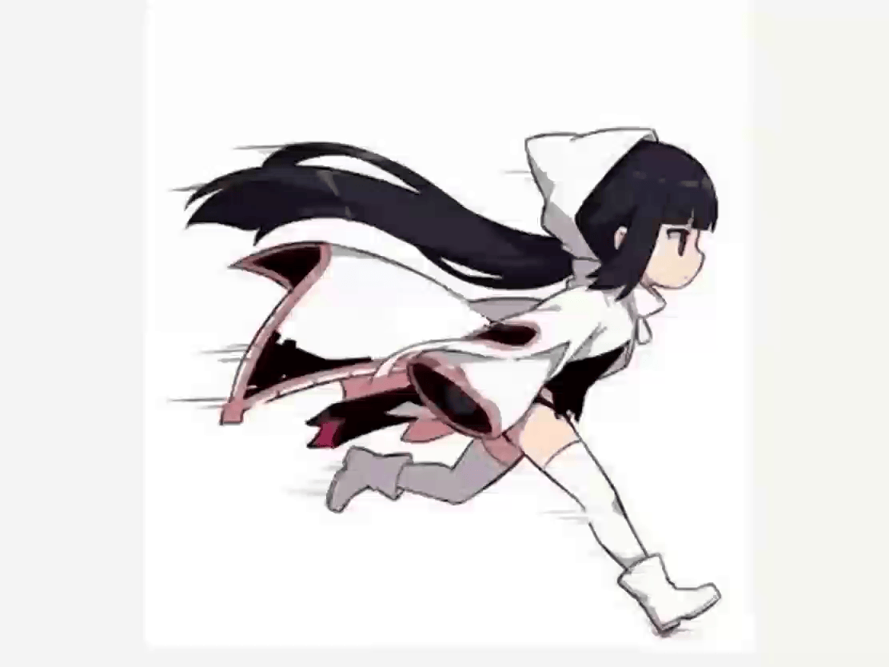

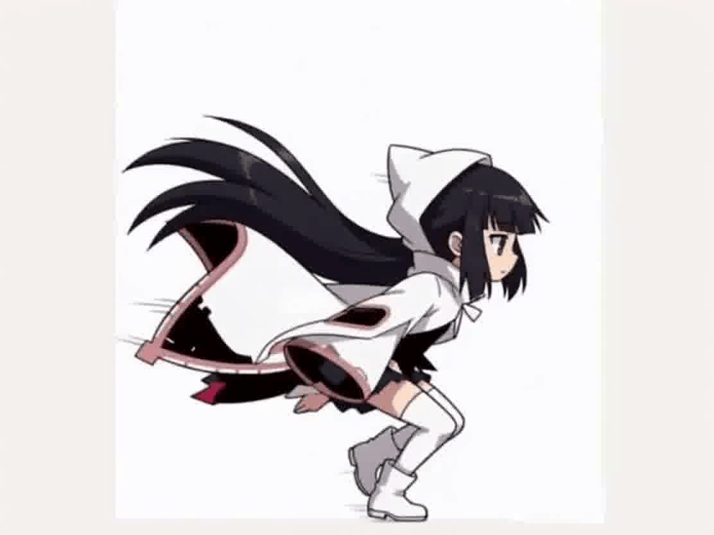

### Erik’s build notes

This stretch was basically the moment the project stopped being “just systems” and started accommodating real content—especially the player asset pipeline. I spun up a dedicated tmpImplementPlayerAsset scene to isolate camera setup and animation hookup without Lv0/Lv2 clutter, then merged in Doris’ sprite/animation work (idle/run/jump) and reorganized the project structure to make it scale (new Animations/ + PlayerAnimation/ folders, sprites metadata, general resource management). The underlying intention was to create a safe sandbox where visual iteration can happen fast, then fold it back into the main game scenes once it’s stable—because rhythm gameplay is already fragile, and mixing it with early animation experimentation is a good way to misdiagnose timing/feel issues.
Lv2 also went through a “bring the whole stage online” pass: adding the scene itself, wiring in audio clips (Lv2-0, Lv2-1 at the time), and populating it with grid/tilemap/pieces/player objects so it’s not just a blank testbed. During that, I temporarily merged SFX + rumble into GameControllerScript and redirected jump/dash sound calls from PieceScript/PlayerScript into the controller. The thought process was pretty pragmatic: when you’re trying to verify that an action feels synced, you want the fewest moving parts and the fewest missing references—so centralizing “feedback” into the controller reduced scene wiring errors while the new assets were landing. (It’s not the cleanest architecture long-term, but it made integration less brittle during the merge window.)
Finally, there was a very “production reality” step: build settings and scene hygiene. I added Lv2 to build settings during integration, then later flipped things so Lv0 is enabled and Lv2 is disabled—basically admitting that Lv2 was still volatile while Lv0 is the safer baseline for a build. There were also small scene cleanups like deactivating a GameObject in Lv0.unity, plus changelog notes to keep future vertical slices in view (barlines/beat lines, slice planning). Overall, the goal here was to absorb a new art/animation pipeline, keep the project organized enough to grow, and avoid shipping builds that depend on whichever scene happens to be “least broken” that day.

## Wed 2026-02-05 - What remains prototype 3

### Ying’s Prototype build notes

Because this is the last prototype before we merge together, this time I make changes on beatmap notes for theme adaptations. So instead of a circle dot as a beatmap note, I’ve changed it to rotated stars this time. The long press note contains bugs when I implement the rotating components so only the long press note remains stationary. Rotating stars did improve the frame rate compared to circle dots, but some players feel eye strains and distractions when reading and processing the beatmap.
Input remains the same as last version. Copyrights remains the same as well.

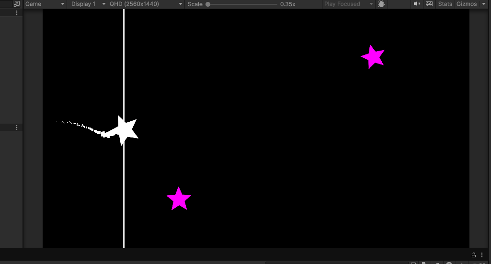

### Erik’s Prototype

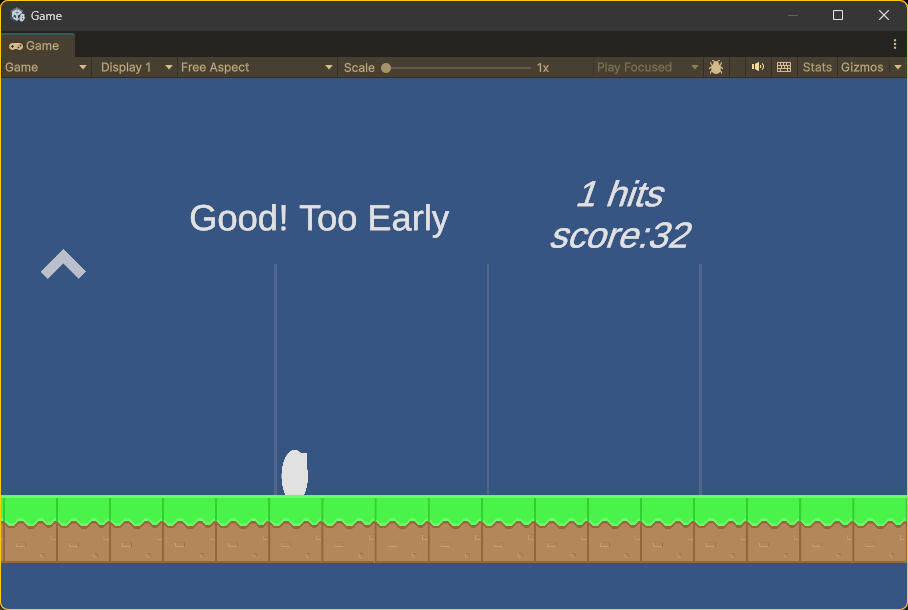

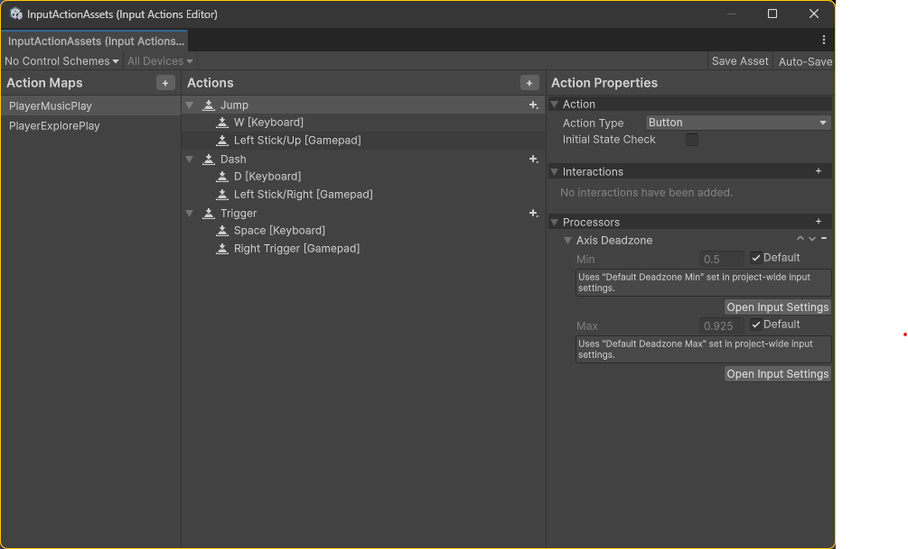

In this prototype, I have added enhanced visual and audio feedback to improve the user experience and to evaluate whether different cues affect players and playtesters. Various textual, audio, and visual signals were included to assess their overall impact and to determine which forms of representation are most effective (for example, the on-screen placement of the combo counter). I also implemented gamepad support with vibration feedback, which is arguably a more immersive experience than using a keyboard.

## Wed 2026-01-28 – Cheap Version Prototype

### Erik’s Prototype

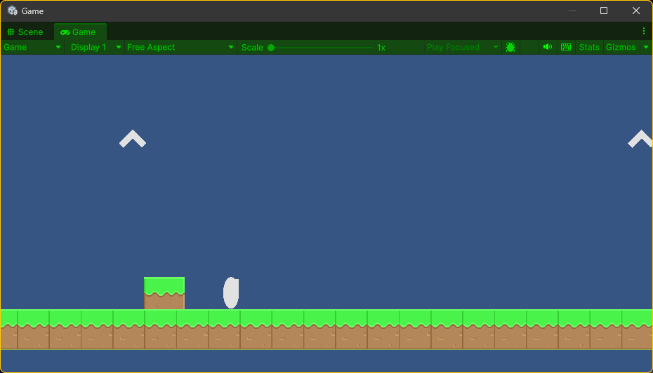

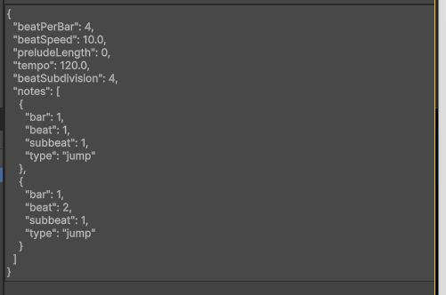

For this week's cheap prototype, I have produced a continuation of previous ideas, yet a completely different fundamental implementation (from the code perspective) in an attempt to achieve similar ideas / player experience. It turns out the previous approach of using physics, timing, and speed control to sync music was unsuccessful and especially unreliable (the sync would break during different builds, when switching to another device, etc.). I have reimplemented the player's control method to support script-based and event-driven control of the player character, using the C# event/delegate system to minimize input lag. There was not a huge detectable lag when using Unity's message feature, but my research has informed me to use C# events. Additionally, I have defined a JavaScript Object Notation (JSON)-based customized beatmap file format, as there is no universal beatmap format (at least none that is open-source and well documented). In support of this, I have also written a basic parser for such a format that places blocks/indication of the note on the map dynamically during runtime.

#### buildnote

this prototype implements a minimal, playable slice of the final game: a single 2D platforming level plus a linked music/rhythm mode with basic transitions, placeholder art, and simplified physics. it demonstrates core gameplay loops and mode-switching without full content or polish

explore mode: WSAD for movement, Space for interactions
music mode: WSD for movement, Space to trigger notes

background music — "City Lights" by tubebackr & HiLau (distributed via Audio Library on YouTube); license: Creative Commons Attribution-NoDerivs 3.0 Unported (CC BY-ND 3.0); requires attribution, prohibits derivative works and removal/alteration of credits, and may require direct permission for uses outside YouTube

## Ying’s Prototype

Based on the playtest from first prototypes, most of the time players can’t recognize original hit or miss feedback, which did not feel any satisfaction when playing. So this week I’ve changed the effect of hit plus the text feedback (perfect/cool/miss) to let the player recognize easier when they hit.
In addition, I’ve created my own music beatmap editor for my prototypes to edit and place each note easier compared to before that I had to edit on the json file directly. Also coordinated current scripts on the song manager for songs selection in the future.
So the current cheap prototype is a music game where the white dot is the player and needs to go up and down, and use the spacebar to hit the notes. Pink notes are single press, blue notes are long press, purple notes are still working on, which originally they are the tap notes that requires player to tap more times.
This time, I still haven’t used any 3rd party libraries besides the Unity engine, and again, Gemini helps me a lot with coding. The temporary song I chose is Hikari from Punishing Gray Raven, and it does have copyright.

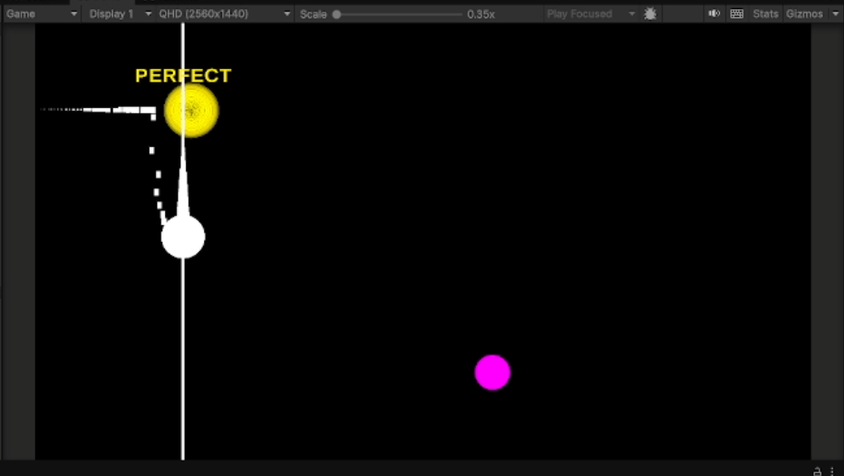

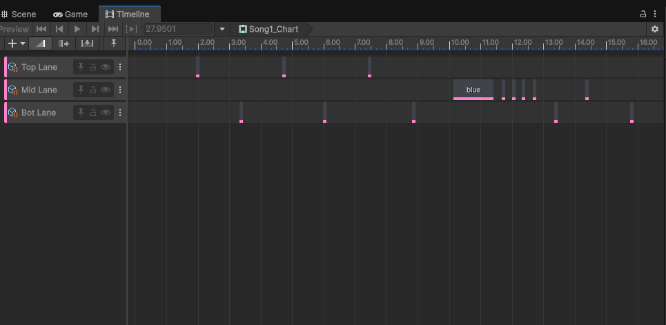

## Wed 2026-01-21 - First Prototypes

### Erik’s Prototype

I have set up various systems, including the input and audio systems. I created a 2D platformer using placeholder assets to explore merging platformers with rhythm-based games. The core gameplay is: jumping on up arrows, and dashing on forward arrows. All these actions are synced to the music. The player moves along a simple platform, with arrows indicating jump timing (matching on the beat.) The current map is composed majorly with tilemap, but I have found using tilemap + rigidbody physics is difficult & time consuming during the development process. Considering dynamically scrolling the camera & placing the obstacles in future builds.

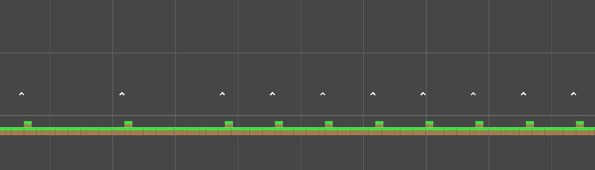

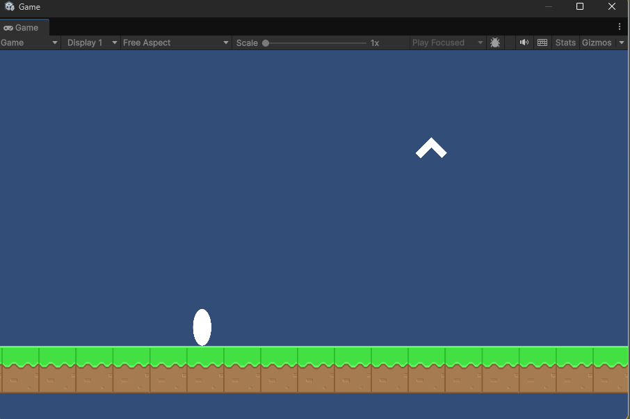

### Erik’s build notes

- question: is there a way to combine a music game and a 2D platformer organically to bring satisfaction to the user
- hypothesis: the Music Component will provide short-term satisfaction through tight audio sync and clear, immediate feedback. The Platformer Part, augmented with story and progression, will provide longer-term engagement and satisfaction
- inputs: currently supports two controls — Space to jump and D to dash.
- third-party assets and licenses:

  - platform game assets — Bayat Games, Unity Asset Store; license: Standard Unity Asset Store EULA (Extension Asset); copyright held by Bayat Games

  - background music — "City Lights" by tubebackr & HiLau (distributed via Audio Library on YouTube); license: Creative Commons Attribution-NoDerivs 3.0 Unported (CC BY-ND 3.0); requires attribution, prohibits derivative works and removal/alteration of credits, and may require direct permission for uses outside YouTube

### Ying’s Prototype

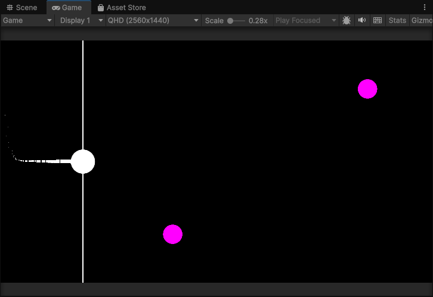

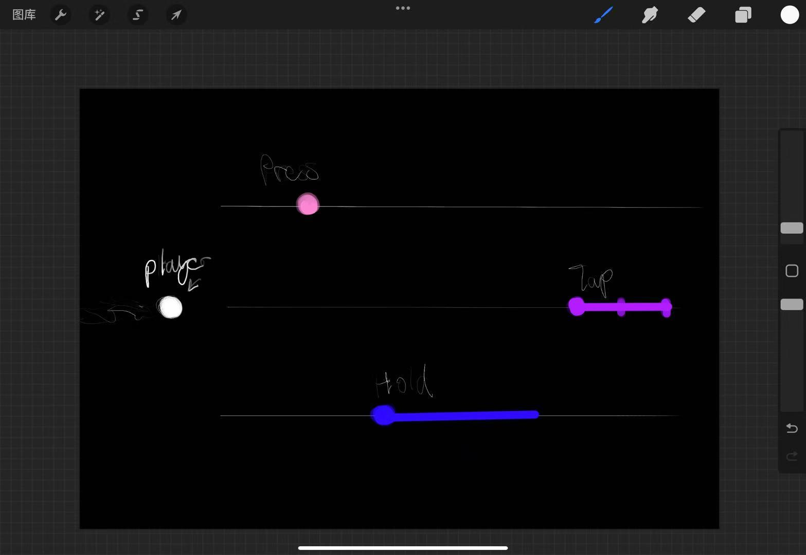

The hypothesis that I’m investigating is letting the player gain satisfaction from a music rhythm-based game, but also cooperate with simple lines and shapes through my prototype.  And I use my prototype to answer the question of “Is there a new mechanic of music rhythm-based game that I haven’t tried out?”

I use simple shapes, trails, and particle effects to make the music-based rhythm game with the main mechanic of the judgement line being stable, but since the player keeps “moving”, the player approaches the music notes that they have to hit. To operate the player object, the player simply needs to do up and down by using w and s from the keyboard and do hit by using the space key. Super basic visuals for now and it’s all about getting the ball physics and paddle control feeling smooth.

I find an interesting point when I’m working on the ideation and this prototype, that most of the music games in the market, especially popular ones, tend to be simple in input and traditional in mechanics. To find a balance between new and traditional mechanics, this actually takes a longer time to brainstorm.

The hypothesis that I’m investigating is letting the player gain satisfaction from a music rhythm-based game, but also cooperate with simple lines and shapes through my prototype.  And I use my prototype to answer the question of “Is there a new mechanic of music rhythm-based game that I haven’t tried out?”

I use simple shapes, trails, and particle effects to make the music-based rhythm game with the main mechanic of the judgement line being stable, but since the player keeps “moving”, the player approaches the music notes that they have to hit. To operate the player object, the player simply needs to do up and down by using w and s from the keyboard and do hit by using the space key. Super basic visuals for now and it’s all about getting the ball physics and paddle control feeling smooth.

I find an interesting point when I’m working on the ideation and this prototype, that most of the music games in the market, especially popular ones, tend to be simple in input and traditional in mechanics. To find a balance between new and traditional mechanics, this actually takes a longer time to brainstorm.

The majority of the assets all came from Unity URP by default. I didn’t import any other libraries, but most of the codes are helped by Gemini and Grok AI.
